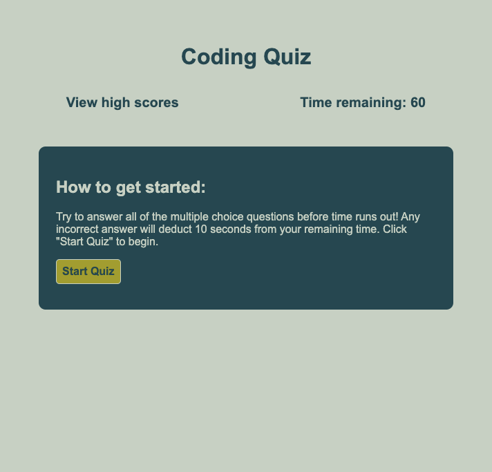

# Code Quiz For Me

## Description
I wanted to build a timed, multiple-choice quiz on JavaScript fundamentals that stores high scores. Users can test their knowledge on javascript basics and compare their progress to others by viewing high scores.

In completing this project I learned a lot about storing and retrieving items to local storage. I learned how to sort arrays, including how to reorganize and sort multiple arrays at the same time. It was also provided practice using for loops, event listeners and writing code from scratch. 

## Table of Contents
- [Usage](#usage)
- [Credits](#credits)
- [License](#license)

## Usage
The quiz loads on a start page, which displays instructions on how to begin. Clicking the "start quiz" button displays the quiz: a question with 4 multiple choice options to choose from. The user is informed of correct/incorrect answers as they progress through the quiz, with the option to view their score (click button "view final score") and save their score. When the score is saved, the leaderboard is displayed, showing the top 5 high scores (retrieved from local storage). Scores are sorted in order from highest to lowest, and both the user's initials and their score are displayed. Users are given the choice to return to the start page from the high scores, which reloads the page. 

[Link to deployed site](https://rbkeyes.github.io/code-quiz-for-me/)

Screenshot of start page:

## Credits
Bootcamp coursework:
- week 4, activities 9 & 10 (timers, intervals)
- week 4, activities 22 & 23 (local storage)

[Creaate a multiple choice quiz using JavaScript](https://www.codeexplained.dev/2018/10/create-multiple-choice-quiz-using-javascript.html)

[HTMLElement.hidden](https://developer.mozilla.org/en-US/docs/Web/API/HTMLElement/hidden)

[mdn web docs "Your first form"](https://developer.mozilla.org/en-US/docs/Learn/Forms/Your_first_form)

[sample quiz](https://codepen.io/boopalan002/pen/yKZVGa)

[sample quiz](https://github.com/mmeii/code-quiz/tree/main/Assets)

[sample quiz](https://github.com/jorguzman100/04_Code_Quiz)

[sample quiz](https://www.codingninjas.com/codestudio/library/how-to-create-a-quiz-app-using-javascript)

[sample quiz](https://github.com/CodeExplainedRepo/Multiple-Choice-Quiz-JavaScript)

[location.reload()](https://developer.mozilla.org/en-US/docs/Web/API/Location/reload)

[saving scores to local storage](https://michael-karen.medium.com/how-to-save-high-scores-in-local-storage-7860baca9d68)

[glow effect](https://codersblock.com/blog/creating-glow-effects-with-css/)

[sort two arrays the same way stackoverflow](https://stackoverflow.com/questions/11499268/sort-two-arrays-the-same-way)

## License
MIT License

Copyright (c) 2022 Reed Keyes

Permission is hereby granted, free of charge, to any person obtaining a copy
of this software and associated documentation files (the "Software"), to deal
in the Software without restriction, including without limitation the rights
to use, copy, modify, merge, publish, distribute, sublicense, and/or sell
copies of the Software, and to permit persons to whom the Software is
furnished to do so, subject to the following conditions:

The above copyright notice and this permission notice shall be included in all
copies or substantial portions of the Software.

THE SOFTWARE IS PROVIDED "AS IS", WITHOUT WARRANTY OF ANY KIND, EXPRESS OR
IMPLIED, INCLUDING BUT NOT LIMITED TO THE WARRANTIES OF MERCHANTABILITY,
FITNESS FOR A PARTICULAR PURPOSE AND NONINFRINGEMENT. IN NO EVENT SHALL THE
AUTHORS OR COPYRIGHT HOLDERS BE LIABLE FOR ANY CLAIM, DAMAGES OR OTHER
LIABILITY, WHETHER IN AN ACTION OF CONTRACT, TORT OR OTHERWISE, ARISING FROM,
OUT OF OR IN CONNECTION WITH THE SOFTWARE OR THE USE OR OTHER DEALINGS IN THE
SOFTWARE.
